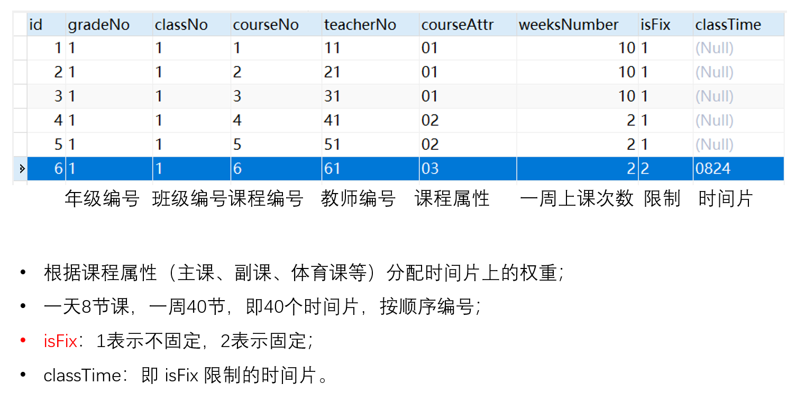

# Course-Scheduling-System

基于遗传算法的排课系统

面向中小学排课

可选——走班制

https://github.com/BeGifted/Course-Scheduling-System

------

硬约束：

1. 一个教师在同一时间段内只能安排一门课程；

2. 一个班级在同一时间段内只能安排一门课程；

3. 一个学生在同一时间段内只能安排一门课程；

   

软约束：

1. 时段限制，即横向时间段限制，格式：对象+时间段+形式+次数。其中对象可选项为【科目，教师】，时间段可选项为【上午、下午、第一节、第二节、···】，形式可选项为【固定、最少、最多】，次数为【0、1、2、···】；

   数据库：xingzhi_schedule_rule_time_limit

2. 各天限制，即纵向时间段限制，格式：对象+时间段+形式+次数。其中对象可选项为【科目，教师】，时间段可选项为【每天、星期一、星期二、星期三、星期四、星期五】，形式可选项为【固定、最少、最多】，次数为【0、1、2、···】；

   数据库：xingzhi_schedule_rule_day_limit

3. 教师互斥，格式：教师A+教师B，A与B不同时上课；√

   数据库：xingzhi_schedule_rule_teacher_limit

4. 科目互斥，格式：科目A+科目B，A与B不排在同一天；√

   数据库：xingzhi_schedule_rule_subject_mutex

5. 科目相邻，格式：科目A+科目B，A与B在同一天相邻；

   数据库：xingzhi_schedule_subject_two

6. 禁止科目相邻，格式：科目A+科目B，A不排于B前面；

   数据库：xingzhi_schedule_rule_subject_adjacent

7. 科目预设，格式：年级+班级+科目+时间+限制，限制可选项为【一定排、尽量排、不排】；

   数据库：xingzhi_schedule_rule_subject_preset

8. 教师预设，格式：教师+时间+限制，限制可选项为【一定排、尽量排、不排】；

   数据库：xingzhi_schedule_rule_teacher_preset

----

名词解释：

基因：某个时间片的值。

染色体：一个班级所有的基因组成的基因串。

个体：包含所有班级的大课程表。

种群：M个不同的个体，即M个不同的年级课程总表。

----

流程图：


----

STEP：

1. 获取开课任务；

   ```java
   List<String> classTaskList
   ```

   

2. 将开课任务进行编码；

   ```java
   List<String> geneList
   ```

   编码规则：是否固定+年级编号+班级编号+教师编号+课程编号+课程属性+开课时间

   （isFix + gradeNo + classNo + teacherNo + courseNo + courseAttr + classTime）

   按照一周上课次数（weeksNumber）拆分成单独的基因，一个班级对应5×8=40个基因。

3. 开始进行时间分配；

   ```java
   List<String> resultGeneList
   ```

   已固定的不分配，未固定的课程任务（基因）随机分配时间片

   原则：随机不重复

4. 对已分配好时间的基因进行分类，生成以所有班级为范围的个体；

   ```java
   Map<String, List<String>> individualMap
   ```

   key值为班级编号，value值为40个基因列表（染色体）。

   individualMap表示生成的一个个体。

5. 重复3、4M次，生成规模为M的种群，即M个个体， 用于遗传进化。

6. 进行遗传进化操作；

   6.1 冲突检测和消除：

   冲突是指同一时间同一教师只能教授一门课程；消除的过程是指若基因A与基因B冲突，则选取与基因B位于同一个体的基因C，进行时间片的互换，若基因C有特定的时间安排，则重新选取C。

   6.2 离散适应度期望值计算：

   离散度是指同一课程在指定班级的分散程度；对位于同一个体中的相同课程的时间差大小，赋予不同的期望值。

   

   6.3 特定课程期望值计算：

   默认的情况下，主课、副课都根据时间片优先级赋予不同的期望值。或根据学校的具体情况指定时间片优先级。

   6.4 选择算子：

   选规模大小为M的种群中的个体，选择M次组成新的规模为M的种群。

   轮盘赌方法，按不同比例大小将轮盘划分为不同的区域，种群中每个个体被选中的概率正比于它的适应度大小。轮盘中比例值越大的区域，其个体的适应度也越高，被选中并遗传给下一代的概率也越大。反之被淘汰的概率较大。

   优化：多轮轮盘赌选择。

   6.4 交叉算子

   将种群中的个体两两配对，记为个体A和个体B，随机选择A与B中的同一个班级，进行班级课表的交换，形成A’ 和B‘ ，选择A与A’ 中适应度较高的进入下一代，B与B’ 同理。

   6.5 变异算子

   针对个体中的染色体（班级课表），选择两条基因，对其进行开课时间的变异（互换）。

   6.6 参数控制

   种群规模M：20-100

   交叉率Pc：0.4-0.9

   变异率Pm：0.001-0.05

   遗传代数T：100-500

7. 分配教室；

8. 存入数据库。


